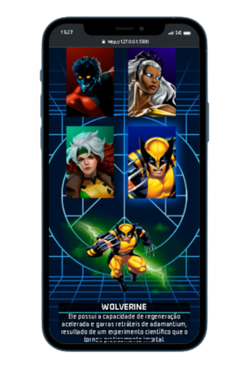

## 💻 Web

  

## 📱 Mobile

  
  

## 📚 Projeto

Esse é um projeto Web Responsivo criado para treinar minhas habilidades, consta em uma seleção de personagem dos X-men e muda a foto e a descrição de acordo com o personagem.

## 🚀 Tecnologias

Esse projeto foi desenvolvido com as seguintes tecnologias:

- HTML
- CSS
- JAVASCRIPT
